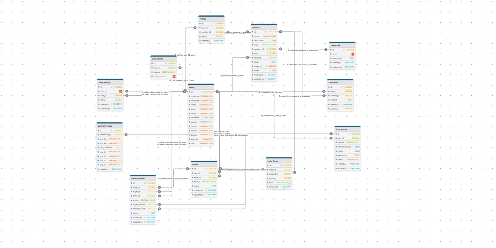
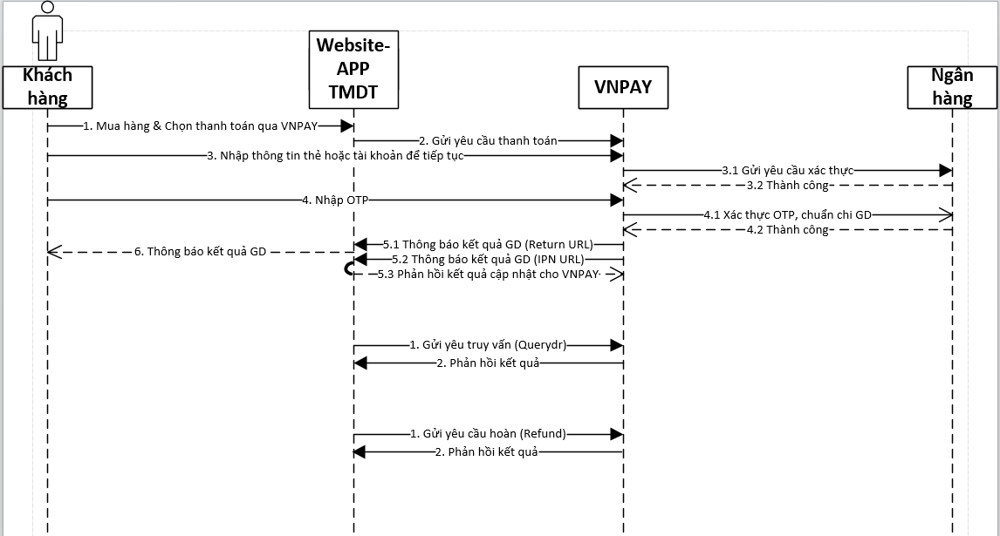

 
## Link Video Demo: https://drive.google.com/file/d/13kz2CLG9arfkaZd3emGMt4ww3VK_hakj/view?usp=sharing
## Tài khoản Admin (Phục vụ cho Demo sản phẩm)
username: admin

password: 7vitsAdmin321


<p align="center">
  
</p>

# Website mua bán vật phẩm, tài sản ảo online - Made by 7VITS - 7vits.id.vn

## Giới thiệu đồ án

Đồ án này xây dựng một **website sàn thương mại điện tử** chuyên dành cho các giao dịch **vật phẩm ảo** như *key game*, *tài khoản game*, *CD-Key*, v.v.

Điểm nổi bật của hệ thống là mô hình giao dịch **"trustless"** – tức là **không yêu cầu các bên phải đặt niềm tin vào bên trung gian hoặc vào nhau**. Thay vào đó, niềm tin được đảm bảo thông qua:

- **Mã nguồn minh bạch**
- **Thuật toán rõ ràng**
- **Cơ chế đồng thuận được thiết kế chặt chẽ**

Website đóng vai trò trung gian đảm bảo giao dịch được thực hiện đúng cam kết giữa người mua và người bán, thông qua:

- **Hợp đồng thông minh (Smart Contract)**  - Dự kiến phát triển trong tương lai gần
- **Cơ chế escrow phi tập trung**

Cơ chế này giúp giảm thiểu rủi ro lừa đảo và gia tăng tính bảo mật, minh bạch trong từng giao dịch.

### Giáo viên hướng dẫn
- Trần Tuấn Dũng
### Lớp : NT208.P22.ANTT
### Nhom 7 - Thành viên thực hiên:
+ 23520468	Bùi Nguyễn Công Hiếu       -  hdevelovyou
+ 23521191	Châu Hoàng Phúc            -  imtynn66
+ 23520166	Nguyễn Hữu Cảnh            -  BlankBire
+ 23520139	Trần Gia Bảo               -  rizy44
+ 23521080	Nguyễn Huỳnh Nhân          -  Fin-tan

### Cấu trúc đồ án
Đồ án gồm 2 phần chính:
-`\be` - Backend, sử dung Nodejs/Express server
-`\fe` - Frontend, sử dụng React application

## Tính năng chính

### Quản lý người dùng
- **Đăng ký, đăng nhập**: Hỗ trợ đăng nhập bằng email/mật khẩu và OAuth (Google, Facebook).
- **Quản lý tài khoản**: Thông tin cá nhân, lịch sử giao dịch, số dư ví điện tử.
- **Hệ thống đánh giá**: Đánh giá sản phẩm.
### Sản phẩm và giao dịch
- **Mua bán sản phẩm ảo**: Đăng bán, tìm kiếm, lọc sản phẩm theo danh mục.
- **Ví điện tử**: Nạp tiền và thanh toán trực tuyến qua ví nội bộ hoặc VNPay.
- **Hệ thống đơn hàng**: Quản lý đơn hàng, theo dõi trạng thái giao dịch.
- **Hệ thống thanh toán**: Hỗ trợ phương thức thanh toán escrow an toàn và bảo mật.
   + Escrow là một cơ chế thanh toán trung gian, nơi tiền của người mua được giữ tạm thời trong một khu vực an toàn (ví dụ như locked_balance) cho đến khi điều kiện cụ thể được đáp ứng
### Đấu giá
- **Hệ thống đấu giá**: Đăng đấu giá sản phẩm, đặt giá, theo dõi phiên đấu giá theo thời gian thực.

### Bảo mật và truyền thông
- **Chat trực tiếp**: Trò chuyện thời gian thực giữa các người dùng, có thể gửi sticker, ảnh.
- **Hệ thống bảo mật**: Xác thực OTP, bảo vệ giao dịch, cơ chế escrow (trung gian).


## Cấu trúc cơ sở dữ liệu

## Cài đặt và chạy dự án

### Yêu cầu
- Node.js (v16+)
- MySQL
- Git
- Tạo tài khoản môi trường test trên VNPay tại https://sandbox.vnpayment.vn/devreg/
- Tạo tài khoản Google - 
- 

### Backend
```bash
# Di chuyển vào thư mục backend
cd be

# Cài đặt các dependencies
npm install


# Tạo file .env với các biến môi trường cần thiết
GOOGLE_CLIENT_ID=your_google_client_id_here
GOOGLE_CLIENT_SECRET=your_google_client_secret_here
API_URL=http://localhost:5000
CLIENT_URL=http://localhost:3000

EMAIL_PASSWORD=your_email_app_password_here
EMAIL_USERNAME=your_email@gmail.com

DB_HOST=your_database_host
DB_USER=your_database_username
DB_PASSWORD=your_database_password
DB_NAME=your_database_name
DB_PORT=your_database_port

GEMINI_API_KEY=your_gemini_api_key_here
PORT=5000
# Chạy server ở chế độ development
npm run dev
```

### Frontend
```bash
# Di chuyển vào thư mục frontend
cd fe

# Cài đặt các dependencies
npm install

# Tạo file .env với các biến môi trường cần thiết
DANGEROUSLY_DISABLE_HOST_CHECK=true
REACT_APP_API_URL=http://localhost:5000

# Chạy ứng dụng React ở chế độ development
npm start
```
## Miêu tả chi tiết các chức năng chính

### Đăng nhập Google (Google OAuth Authentication)

#### Tổng quan
Hệ thống tích hợp chức năng đăng nhập Google OAuth 2.0, cho phép người dùng đăng nhập nhanh chóng và an toàn bằng tài khoản Google của họ mà không cần tạo tài khoản mới.

#### Quy trình hoạt động

##### 1. Khởi tạo đăng nhập
- Người dùng nhấp vào nút "Đăng nhập với Google" 
- Hệ thống chuyển hướng tới `${API_URL}/api/auth/google`
- Server sử dụng Passport.js với GoogleStrategy để xử lý OAuth

##### 2. Xác thực với Google
- Google hiển thị trang đồng ý quyền truy cập (scope: profile, email)
- Người dùng xác nhận và cấp quyền
- Google callback tới `${API_URL}/api/auth/google/callback`

##### 3. Xử lý sau xác thực
**Trường hợp 1: Người dùng mới**
- Tạo tài khoản mới với thông tin từ Google
- Tự động tạo ví điện tử với số dư 0
- Yêu cầu thiết lập username và password (chuyển hướng tới trang setup)

**Trường hợp 2: Người dùng đã tồn tại**
- Liên kết Google ID với tài khoản hiện có
- Đăng nhập trực tiếp và chuyển hướng về trang chính

##### 4. Hoàn tất đăng nhập
- Tạo JWT token với thời gian hết hạn 24h
- Lưu thông tin người dùng vào localStorage
- Cập nhật trạng thái đăng nhập trong ứng dụng

#### Tính năng bảo mật
- **Token JWT**: Bảo mật và xác thực phiên làm việc
- **Xử lý lỗi**: Thông báo rõ ràng khi có xung đột email hoặc lỗi xác thực
- **Validation**: Kiểm tra và xác thực thông tin từ Google

#### Công nghệ sử dụng
- **Backend**: Passport.js, passport-google-oauth20, JWT
- **Frontend**: React Router, Axios
- **Database**: MySQL với bảng users hỗ trợ googleId

---

### Đăng bán sản phẩm (Product Listing)

#### Tổng quan
Chức năng cho phép người dùng đăng bán các sản phẩm ảo như Game Key, Account Game, CD-Key với giao diện thân thiện và quy trình đơn giản.

#### Quy trình đăng sản phẩm

##### 1. Truy cập trang đăng bán
- Đường dẫn: `/sell-product`
- Yêu cầu: Phải đăng nhập (có JWT token)
- Giao diện: Form chi tiết với validation

##### 2. Nhập thông tin sản phẩm
**Thông tin bắt buộc:**
- **Tên sản phẩm**: Tiêu đề mô tả sản phẩm
- **Mô tả chi tiết**: Thông tin về sản phẩm
- **Giá bán**: Định dạng VNĐ với separator (tự động format)
- **Danh mục**: Lựa chọn từ dropdown (Game Key, App Key, Account)
- **Ghi chú**: Thông tin key/tài khoản sẽ giao cho buyer

**Thông tin tùy chọn:**
- **Hình ảnh**: Upload ảnh sản phẩm (hỗ trợ JPG, PNG, GIF, WEBP, tối đa 2MB)

##### 3. Upload và xử lý hình ảnh
- Kiểm tra định dạng file và kích thước
- Chuyển đổi sang Base64 để lưu trữ
- Hiển thị preview trước khi submit

##### 4. Validation và lưu trữ
**Backend validation:**
- Kiểm tra quyền truy cập (JWT token)
- Validate các trường bắt buộc
- Xử lý và lưu vào database

**Database operations:**
- Insert vào bảng `products` với `seller_id`
- Tự động set `stock = 1` và `status = 'active'`
- Lưu image dưới dạng Base64 string

##### 5. Quản lý sản phẩm đã đăng
- Xem danh sách sản phẩm tại `/my-products`
- Chỉnh sửa thông tin sản phẩm
- Thay đổi trạng thái (active/inactive)
- Xóa sản phẩm nếu chưa có đơn hàng

#### Tính năng nổi bật
- **Real-time validation**: Kiểm tra dữ liệu ngay khi nhập
- **Price formatting**: Tự động format giá với dấu chấm phân cách
- **Image optimization**: Tự động resize và tối ưu ảnh
- **Security**: Chỉ chủ sản phẩm mới có thể chỉnh sửa

---

### Chat Bot AI (VitBot)

#### Tổng quan
VitBot là trợ lý AI thông minh được phát triển bằng Google Gemini AI, hỗ trợ khách hàng 24/7 với khả năng tư vấn sản phẩm, chính sách và hướng dẫn mua hàng.

#### Tính năng chính

##### 1. Giao diện Chat
- **Floating button**: Biểu tượng chat nổi ở góc màn hình
- **Responsive design**: Tự động ẩn hiện trên các trang khác nhau
- **Modern UI**: Giao diện đẹp với animation mượt mà

##### 2. Khả năng hỗ trợ
**Tư vấn chính sách:**
- Chính sách đổi trả (7 ngày)
- Quy định bảo hành sản phẩm
- Chính sách rút tiền cho người bán
- Điều khoản sử dụng

**Hướng dẫn mua hàng:**
- Quy trình thanh toán
- Cách nhận sản phẩm
- Hướng dẫn nạp tiền ví
- Cách đánh giá sản phẩm

**Thông tin liên hệ:**
- Hotline: 1900-7777
- Email: 7vits.shop@gmail.com
- Fanpage: 7VITS
- Thời gian hỗ trợ: 8h-22h

##### 3. Công nghệ AI

**Google Gemini Integration:**
- Model: gemini-1.5-flash (latest)
- API Key authentication
- Context-aware responses

**Conversation Management:**
- Lưu lịch sử hội thoại trong session
- Context switching cho câu hỏi liên quan
- Memory của cuộc hội thoại trước đó

**Prompt Engineering:**
```
CUSTOMER_SUPPORT_PROMPT = Detailed system prompt defining:
- Bot personality (VitBot - thân thiện, chuyên nghiệp)
- Shop information (7Vits, chính sách, liên hệ)
- Response guidelines (tiếng Việt, chi tiết, hướng dẫn)
- Shop policies (đổi trả, bảo hành, quy định...)
```

##### 4. Tính năng tương tác

**Quick Questions:**
- "Chính sách đổi trả như thế nào?"
- "Cách mua tài khoản game?"
- "Cách thanh toán online?"
- "Thời gian bảo hành bao lâu?"

**Message Features:**
- Real-time typing
- Message timestamp
- Error handling với retry
- Loading indicators

**Conversation Controls:**
- Reset conversation
- Message history
- Scroll to latest message
- Auto-focus input

##### 5. Backend API

**Endpoint: `/api/chatbot/message`**
```javascript
{
  message: "Câu hỏi của user",
  conversationHistory: [
    { role: "user", content: "..." },
    { role: "assistant", content: "..." }
  ]
}
```

**Response Format:**
```javascript
{
  success: true,
  response: "Câu trả lời từ AI",
  timestamp: "2024-01-01T00:00:00.000Z"
}
```

##### 6. Error Handling
- **API Key validation**: Kiểm tra Gemini API key
- **Rate limiting**: Xử lý giới hạn API calls
- **Network errors**: Thông báo lỗi mạng
- **Graceful degradation**: Fallback khi AI không khả dụng
---
### Mua hàng, Thanh toán
#### 1. Tổng quan chức năng
Hệ thống thanh toán của 7VITS được xây dựng dựa trên cơ chế escrow, đảm bảo an toàn cho cả người mua và người bán thông qua việc khóa tiền trong quá trình giao dịch.

#### 2. Quy trình thanh toán chi tiết

##### 2.1. Khởi tạo đơn hàng
- Người dùng chọn sản phẩm và gửi yêu cầu tạo đơn hàng
- Backend nhận thông tin gồm danh sách sản phẩm (`items`) và tổng tiền (`totalAmount`)
- Hệ thống tạo `idempotencyKey` để đảm bảo không xử lý trùng lặp đơn hàng

##### 2.2. Kiểm tra điều kiện trước giao dịch
- Xác thực danh sách sản phẩm tồn tại và còn hàng (`status = 'active'`)
- Kiểm tra người mua không phải là người bán
- Đảm bảo tất cả sản phẩm đều từ cùng một người bán
- Kiểm tra số dư ví của người mua đủ để thanh toán

##### 2.3. Xử lý giao dịch với Transaction Database
Hệ thống sử dụng transaction SQL để đảm bảo tính toàn vẹn dữ liệu:

1. **Khóa ví người dùng**: Khóa ví người mua và người bán theo thứ tự ID tăng dần để tránh deadlock
2. **Kiểm tra số dư**: Xác nhận số dư người mua đủ để thực hiện giao dịch
3. **Khóa sản phẩm**: Khóa các sản phẩm được mua để tránh bán trùng lặp
4. **Tạo đơn hàng**: Lưu thông tin đơn hàng với trạng thái "pending"
5. **Tạo chi tiết đơn hàng**: Lưu danh sách sản phẩm thuộc đơn hàng
6. **Cập nhật ví theo cơ chế Escrow**:
   - Trừ tiền từ ví người mua
   - Chuyển vào locked_balance của người bán (chưa nhận được ngay)
7. **Cập nhật trạng thái sản phẩm**: Đánh dấu sản phẩm thành "inactive" để không hiển thị cho người khác
8. **Tạo bản ghi giao dịch**: Ghi nhận giao dịch mua hàng và thu nhập cho người bán (pending)

##### 2.4. Xử lý sau giao dịch
- Hệ thống có cơ chế retry khi xảy ra deadlock hoặc timeout (tối đa 3 lần)
- Nếu có lỗi, toàn bộ giao dịch được rollback để đảm bảo dữ liệu nhất quán
- Hàm `cleanupFailedOrder` dọn dẹp dữ liệu nếu đơn hàng bị lỗi

##### 2.5. Xác nhận đơn hàng và hoàn tất thanh toán
Sau khi người mua nhận được sản phẩm và xác nhận:
- Chuyển tiền từ locked_balance sang balance của người bán
- Cập nhật trạng thái đơn hàng và giao dịch thành "completed"
- Đánh dấu sản phẩm đã bán với trạng thái "sold_out"

##### 2.6. Xử lý từ chối đơn hàng
Nếu có vấn đề, người mua có thể từ chối đơn hàng:
- Hoàn tiền từ locked_balance của người bán về balance người mua
- Cập nhật trạng thái đơn hàng và giao dịch thành "cancelled"
- Đặt lại trạng thái sản phẩm thành "active" để có thể bán lại

#### 3. API Backend chính
- `POST /api/orders/create`: Tạo đơn hàng mới
- `GET /api/orders/user`: Lấy danh sách đơn hàng của người dùng
- `PUT /api/orders/:id/confirm`: Xác nhận đã nhận sản phẩm
- `PUT /api/orders/:id/reject`: Từ chối đơn hàng và yêu cầu hoàn tiền
- `GET /api/orders/:id`: Lấy chi tiết đơn hàng
- `GET /api/wallet/balance`: Lấy số dư ví hiện tại

### Nạp tiền bằng VNPay
####  **Tài khoản test thanh toán**
<table>
  <tr>
    <th colspan="2" style="text-align:center;">🪪 Thông tin thẻ</th>
  </tr>
  <tr>
    <td><b>Ngân hàng</b></td><td>NCB</td>
  </tr>
  <tr>
    <td><b>Số thẻ</b></td><td>9704198526191432198</td>
  </tr>
  <tr>
    <td><b>Tên chủ thẻ</b></td><td>NGUYEN VAN A</td>
  </tr>
  <tr>
    <td><b>Ngày phát hành</b></td><td>07/15</td>
  </tr>
  <tr>
    <td><b>Mật khẩu OTP</b></td><td>123456</td>
  </tr>
</table>

#### Quy trình nạp tiền

##### 1. Khởi tạo giao dịch
- Người dùng truy cập trang "Nạp tiền" từ trang cá nhân
- Nhập số tiền muốn nạp 

##### 2. Tạo yêu cầu thanh toán
- Backend tạo mã giao dịch duy nhất (txnRef)
- Thiết lập các tham số VNPay (amount, returnUrl, ipAddr, etc.)
- Tạo chữ ký số (secureHash) để bảo mật giao dịch
- Lưu thông tin giao dịch vào bảng transactions với trạng thái "pending"

##### 3. Chuyển hướng đến VNPay
- Người dùng được chuyển hướng đến cổng thanh toán VNPay
- Chọn phương thức thanh toán (thẻ ATM, thẻ tín dụng, QR code)
- Nhập thông tin thẻ và xác thực OTP

##### 4. Xử lý kết quả thanh toán
- Server nhận thông tin từ VNPay qua returnUrl
- Xác thực chữ ký và thông tin giao dịch
- Kiểm tra trạng thái thanh toán từ VNPay

**Xử lý thành công:**
- Cập nhật trạng thái giao dịch thành "completed"
- Cộng tiền vào ví người dùng (balance)
- Tạo lịch sử giao dịch với loại "deposit"
- Hiển thị thông báo thành công và số dư mới

**Xử lý thất bại:**
- Cập nhật trạng thái giao dịch thành "failed"
- Ghi log lỗi để kiểm tra sau
- Hiển thị thông báo lỗi và hướng dẫn thử lại

### Đấu giá
1. **Tạo phiên đấu giá**
   - Người dùng đăng sản phẩm để đấu giá
   - Thiết lập giá khởi điểm và thời gian kết thúc
   - Cung cấp mô tả chi tiết và hình ảnh sản phẩm
   - Hệ thống tạo phiên đấu giá với trạng thái "ongoing"

2. **Tham gia đấu giá**
   - Người dùng xem danh sách các phiên đấu giá đang diễn ra
   - Đặt giá cao hơn giá hiện tại (hệ thống kiểm tra số dư và tính hợp lệ)
   - Theo dõi trạng thái đấu giá theo thời gian thực
   - Nhận thông báo khi có người đặt giá cao hơn

3. **Kết thúc đấu giá**
   - Hệ thống tự động xác định người thắng cuộc khi đến thời gian kết thúc
   - Trừ tiền từ tài khoản người thắng và chuyển vào locked_balance người bán
   - Tạo đơn hàng tự động với trạng thái pending
   - Gửi thông báo cho người thắng và người bán

4. **Xử lý sau đấu giá**
   - Xác nhận giao nhận sản phẩm theo quy trình mua hàng thông thường
   - Hoàn tiền nếu có tranh chấp hoặc hủy đấu giá

### Chat giữa user
1. **Kết nối người dùng**
   - Tạo kênh chat giữa người mua và người bán
   - Hiển thị trạng thái online/offline của người dùng
   - Thông báo khi có tin nhắn mới

2. **Tính năng chat**
   - Gửi tin nhắn văn bản theo thời gian thực
   - Chia sẻ hình ảnh và sticker
   - Xem lịch sử tin nhắn trước đó
   - Thông báo đã xem tin nhắn

3. **Bảo mật và quản lý**
   - Mã hóa tin nhắn
   - Lưu trữ lịch sử chat an toàn
   - Báo cáo người dùng vi phạm
   - Chặn người dùng không mong muốn

4. **Tích hợp với giao dịch**
   - Trao đổi thông tin về sản phẩm
   - Đàm phán giá cả
   - Chia sẻ mã xác thực sản phẩm
   - Hỗ trợ giải quyết vấn đề sau khi mua hàng

## Công nghệ sử dụng

### Frontend
- **React**: Thư viện xây dựng giao diện người dùng
- **React Router**: Quản lý định tuyến và điều hướng
- **Axios**: Xử lý các yêu cầu HTTP
- **SCSS/Sass**: Tiền xử lý CSS để tạo kiểu
- **Socket.io-client**: Giao tiếp thời gian thực (chat, thông báo)
- **Redux/Redux Toolkit**: Quản lý trạng thái toàn cục
- **React Query**: Quản lý trạng thái máy chủ và bộ nhớ đệm
- **Material-UI**: Thư viện thành phần giao diện
- **Formik & Yup**: Xử lý form và xác thực
- **React Icons**: Thư viện biểu tượng
- **React Toastify**: Thông báo toast

### Backend
- **Node.js/Express**: Framework máy chủ web
- **MySQL**: Hệ quản trị cơ sở dữ liệu quan hệ
- **JWT (JSON Web Tokens)**: Xác thực người dùng
- **Bcrypt**: Mã hóa mật khẩu
- **Socket.io**: Xử lý kết nối thời gian thực
- **Nodemailer**: Gửi email thông báo và xác thực
- **VNPay API**: Tích hợp cổng thanh toán
- **Multer**: Xử lý tải lên tệp
- **Cors**: Chia sẻ tài nguyên đa nguồn gốc
- **Dotenv**: Quản lý biến môi trường
- **Node-cron**: Lập lịch tác vụ tự động
- **Express-validator**: Middleware xác thực
- **Morgan**: Ghi log yêu cầu HTTP
- **Helmet**: Middleware bảo mật

### Công cụ phát triển
- **Git**: Quản lý phiên bản
- **npm**: Quản lý gói
- **ESLint**: Kiểm tra mã
- **Prettier**: Định dạng mã
- **Postman**: Kiểm thử API
- **MySQL Workbench**: Quản lý cơ sở dữ liệu
- **VS Code**: Môi trường phát triển tích hợp

### Triển khai & Lưu trữ
- **Vercel**: Lưu trữ Frontend
- **Railway**: Lưu trữ Backend
- **MySQL Hosting**: Lưu trữ cơ sở dữ liệu
- **Cloudinary**: Lưu trữ hình ảnh
- **GitHub**: Kho lưu trữ mã nguồn

### Bảo mật
- **JWT Authentication**: Xác thực người dùng
- **Bcrypt Password Hashing**: Mã hóa mật khẩu
- **CORS Protection**: Bảo vệ yêu cầu đa nguồn gốc
- **Helmet Security Headers**: Bảo mật HTTP headers
- **Rate Limiting**: Giới hạn tốc độ yêu cầu
- **Input Validation**: Kiểm tra dữ liệu đầu vào
- **SQL Injection Prevention**: Bảo vệ cơ sở dữ liệu
- **XSS Protection**: Bảo vệ tấn công XSS
- **CSRF Protection**: Bảo vệ tấn công CSRF

### Hiệu suất & Tối ưu hóa
- **React Query Caching**: Quản lý bộ nhớ đệm
- **Image Optimization**: Tối ưu hóa hình ảnh
- **Code Splitting**: Chia nhỏ bundle
- **Lazy Loading**: Tải components khi cần
- **Database Indexing**: Tối ưu truy vấn
- **Connection Pooling**: Quản lý kết nối cơ sở dữ liệu
- **Compression**: Nén dữ liệu phản hồi
- **Caching**: Bộ nhớ đệm tài nguyên tĩnh

## Những thiếu sót 
Dự án về cơ bản hoàn thiện các tính năng của một trang thương mại điện tử, một sàn giao dịch trung gian giữa người dùng và người dùng (mô hình P2P). Nhưng cũng có những thiếu sót với yêu cầu ban đầu của Giáo viên hướng dẫn:
- Chưa tích hợp Smart Constract để tăng tính minh bạch
   + Lý do:
      + Phí gas cao: Chi phí giao dịch (gas fee) trên các mạng blockchain hiện tại (ví dụ: Ethereum) quá cao, gây gánh nặng tài chính đáng kể cho người dùng và làm giảm tính khả thi của việc triển khai rộng rãi.
      + Hạn chế về tài nguyên: Việc tìm kiếm giải pháp tối ưu hóa gas fee gặp nhiều khó khăn. Đồng thời, lượng SepoliaETH (mạng thử nghiệm) hiện có không đủ để thực hiện các thử nghiệm và triển khai Smart Contract một cách đầy đủ.
   + Tác động: Việc không tích hợp Smart Contract ảnh hưởng đến khả năng cung cấp mức độ minh bạch tuyệt đối và tự động hóa giao dịch mà công nghệ blockchain có thể mang lại.
   + Biện pháp khắc phục: sử dụng VNPay thay thể, nhưng vẫn áp dụng cơ chế escrow thông qua phương thức khóa ví tạm thời. 
- Chưa có hệ thống ghi nhận giao dịch bằng blockchain và công khai lên toàn bộ người dùng. 
## Định hướng phát triển trong tương lai

Dự án đang trong giai đoạn phát triển. Hướng phát triển tiếp theo cho đồ án
- Tích hợp thêm phương thức thanh toán (Momo, Visa, Paypal,... )
- Tích hợp thêm hệ thống thanh toán bằng blockchain, Smart Contracts. Khám phá các Layer 2 solutions hoặc các nền tảng blockchain khác với chi phí giao dịch thấp hơn, nhằm đáp ứng đầy đủ yêu cầu về tính minh bạch tuyệt đối trong tương lai.
- Thêm tính năng "Biến động số dư" thông qua dữ liệu lưu trong bảng transacstions
- Cải thiện hệ thống chat, thêm thông báo thời gian thực
- Phát triển ứng dụng di động

## Giấy phép

Dự án này được phát triển cho mục đích học tập và nghiên cứu.

## Liên hệ

Để biết thêm thông tin, vui lòng liên hệ qua email: 7vits.shop@gmail.com


